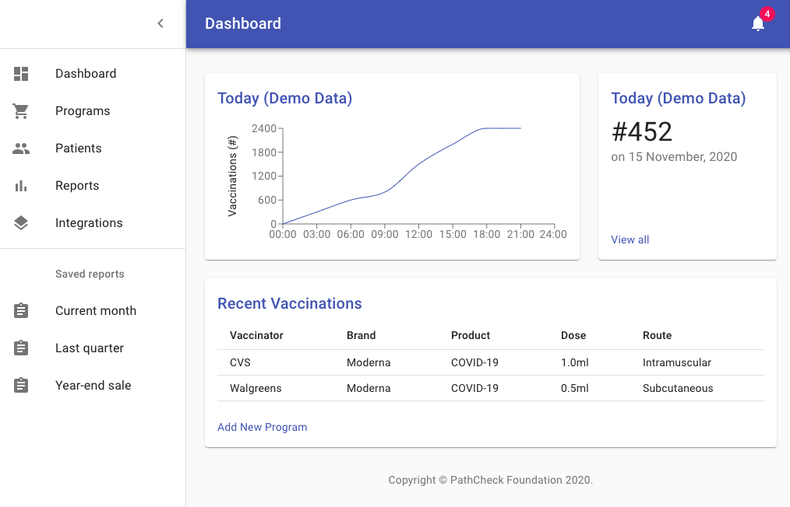

# Health Passport Health Provider Portal React UI

This is a React interface for a Health Provider portal to manage and sign Vaccination Certificates. 

## Behaviour

1. Health Provider Signs UP for the service. 
2. Health Provider creates a Vaccination Program. 
3. Health Provider generates a QR code, prints and places it visible for patients to scan. 

4. Patiens scan the QR Code after testing. 
5. QR Code takes patients to this portal, where. 
5.1. Users add their name to the certificate
5.2. Press button to generate and download. 
5. Portal generates que QR code text, signs and starts downloading the QR code with the Vaccine Certification. 

6. Users load on their signed certificate to the [Health Passport Reader app](https://github.com/vitorpamplona/healthpassport-reader-app). 

## Features / TO-DO List

- [x] Health Provider Sign Up
- [x] Health Provider Login 
- [x] Home Page
- [x] New Vaccination Programs
- [x] Listing Vaccination Programs on Home Page
- [ ] Health Provider's Password recovery (Forgot My Password logic)
- [ ] Edit Vaccination Program
- [ ] Generate and Sign Vaccination Program QR Code to Print
- [ ] Accept patient access to ask for their Name and sign the QR Code with Provider's Primary Key
- [ ] Generate and Download Patient's signed Certificate. 
- [ ] Make sure the Home Page is only accessible when Signed in

## Running

Make sure you have everything you need to run a React service. 

Install modules:
`npm install`

Start UI
`npm start`